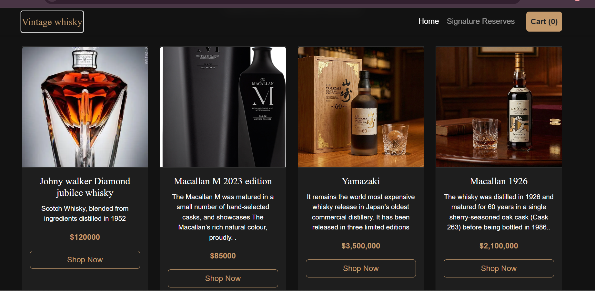
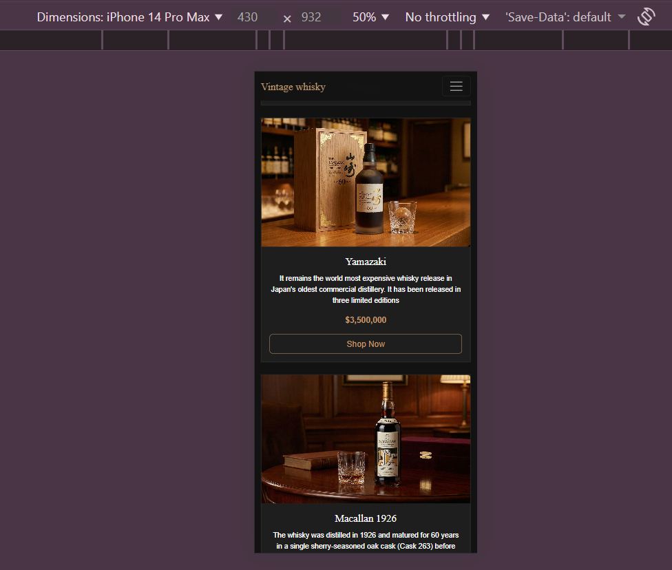

 Project Overview
Vintage whisky is a concept landing page for an exclusive online store selling rare and vintage whiskies (such as the Yamazaki 60-year-old and Macallan 1926). 

The goal of this project was to create a visually appealing and fully responsive layout that adapts seamlessly from desktop monitors to mobile phones, maintaining a premium "luxury" feel throughout.

 Features
Fully Responsive Layout
Desktop:Displays a 4-column grid for products and an expansive hero banner.
Mobile: Automatically stacks products into a single column and collapses the navigation menu into a hamburger toggle.

 Vintage Aesthetic
Dark Mode:Utilizes a deep charcoal background (`#1a1a1a`) to reduce eye strain and evoke a "night-time/bar" atmosphere.
Gold Accents: Custom CSS variables (`--gold`) used for buttons and prices to mimic the color of whisky.
 Functional Components
Navigation:Fixed-top navbar that stays visible while scrolling.
Hero Section: Full-width background image with a "Call to Action" button.
Product Cards:Interactive cards with hover effects (lift and glow).

Technologies Used

| Technology | Usage |

HTML5 Semantic structure (Header, Nav, Section, Footer). |
CSS3| Custom variables, media queries, and hover animations. |
Bootstrap 5 | Grid system, responsive utilities, and pre-built components (Navbar, Cards). |
|Google Fonts| Playfair Display (Serif) for headers & *Lato* (Sans-serif) for body text. |

---

 Design Choices & Philosophy

 1. The "Luxury" Color Palette
I chose a Dark UI strategy. Luxury brands often use black/dark backgrounds to make product images pop. 
Primary:Deep Charcoal `#121212` (Background)
 Accent: Antique Gold `#c49a6c` (Buttons/Highlights)
 Text:Off-White `#f0f0f0` (Readability without harsh contrast)

 2. Typography Pairing
Headers: Used Playfair Display. It is a classic Serif font that mimics old newspaper headlines and premium liquor labels.
Body: Used Lato. It is a clean Sans-Serif font that ensures descriptions are easy to read at small sizes.

 3. Hybrid Responsiveness
I utilized a "Bootstrap First, Custom Second"** approach:
Bootstrap Grid: Used `col-12` (mobile) to `col-lg-3` (desktop) for the product grid.
Media Queries:Added a custom `@media (max-width: 768px)` rule to shrink the large Hero Text on mobile devices so it fits the screen without overflowing.
Screenshots
Desktop View

 Mobile View
